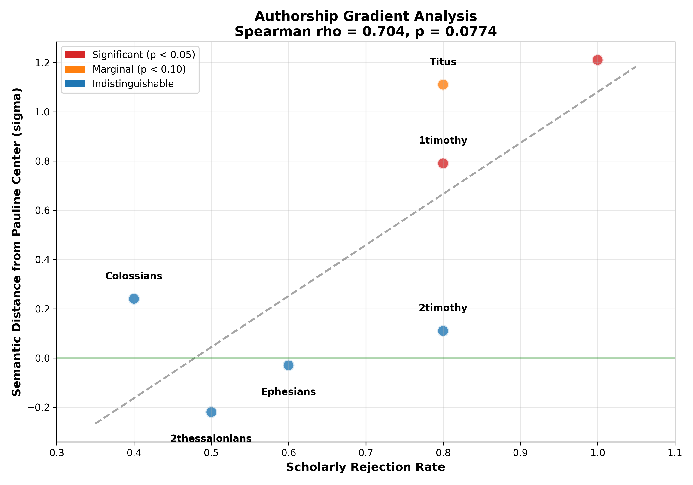

# The Neural Scribe: Authorship Gradient Detection

**Project Type**: Feasibility Pilot for NCN SONATINA Grant  
**Method**: One-Class Neural Classification with Gradient Testing

## Scientific Goal

This pilot tests whether neural embeddings detect an **authorship gradient** 
consistent with scholarly consensus on Pauline authorship:

| Text | Scholarly Status | Rejection Rate |
|------|------------------|----------------|
| Undisputed Paul | Authentic | 0% |
| Colossians | Contested | ~40% |
| 2 Thessalonians | Contested | ~50% |
| Ephesians | Contested | ~60% |
| 1 Timothy | Likely pseudepigraphal | ~80% |
| 2 Timothy | Likely pseudepigraphal | ~80% |
| Titus | Likely pseudepigraphal | ~80% |
| Hebrews | Non-Pauline (consensus) | 100% |

## Methodology

### One-Class Classification
The baseline centroid and variance are computed using ONLY undisputed Pauline 
texts. Disputed texts are then measured against this baseline without 
influencing it, avoiding circular reasoning.

### Distance Metric
Cosine distance with mean pooling, normalized by intra-Pauline variance:
- σ = 0.0 represents the Pauline centroid
- Positive values indicate divergence from Pauline baseline (in SD units)
- Negative values indicate texts *closer* to centroid than typical Pauline texts

### Metric Selection Rationale

Cosine distance was selected based on:
1. **Literature standard**: Default metric for sentence embeddings 
   (Reimers & Gurevych 2019)
2. **Directional similarity**: Measures semantic orientation independent 
   of magnitude
3. **High-dimensional stability**: No covariance estimation required

### Statistical Framework
- **One-sample t-test**: Tests if target mean differs from 0 (Paul's center)
- **Cohen's d**: Effect size for practical significance
- **Spearman ρ**: Tests gradient correlation with scholarly consensus

## Results

| Text | N chunks | Distance (σ) | 95% CI | P-Value | Cohen's d |
|------|----------|--------------|--------|---------|-----------|
| Paul (baseline) | 314 | 0.00 | — | — | — |
| Colossians | 20 | 0.24 | [-0.20, 0.69] | 0.261 | 0.25 |
| 2 Thessalonians | 10 | -0.22 | [-0.70, 0.26] | 0.320 | -0.26 |
| Ephesians | 31 | -0.03 | [-0.39, 0.33] | 0.868 | -0.03 |
| 1 Timothy | 20 | **0.79** | [0.39, 1.20] | **0.0007** | **0.84** |
| 2 Timothy | 15 | 0.11 | [-0.61, 0.83] | 0.748 | 0.09 |
| Titus | 8 | 1.11 | [-0.10, 2.32] | 0.067 | 0.89 |
| Hebrews | 65 | **1.21** | [0.75, 1.67] | **<0.0001** | **0.81** |

**Gradient Correlation** (n=7 texts): Spearman ρ = 0.704, p = 0.077

### Chunk Distribution Analysis

| Text | % > P75 | % > P90 | % > P95 |
|------|---------|---------|---------|
| Paul (expected) | 25.0% | 10.0% | 5.0% |
| Colossians | 35.0% | 10.0% | 10.0% |
| 2 Thessalonians | 20.0% | 0.0% | 0.0% |
| Ephesians | 16.1% | 9.7% | 9.7% |
| 1 Timothy | 65.0% | 20.0% | 10.0% |
| 2 Timothy | 33.3% | 20.0% | 20.0% |
| Titus | 50.0% | 37.5% | 37.5% |
| Hebrews | **58.5%** | **43.1%** | **38.5%** |

### Statistical Power Note

With n=7 texts for gradient correlation, power to detect ρ = 0.70 at α = 0.05 
is approximately 0.65. The observed p = 0.077 is consistent with a true effect 
that requires larger sample size to confirm. The full SONATINA project will 
include additional texts and fine-tuned models to increase statistical power.

### Note on Negative Distances

2 Thessalonians (-0.22σ) and Ephesians (-0.03σ) show *negative* distances, 
meaning they cluster closer to the Pauline centroid than the average undisputed 
Pauline text. This may indicate:

1. **Authentic authorship** with particularly "Pauline" characteristics
2. **Stylistic averaging** in these shorter/mid-length texts
3. **Successful mimicry** producing hyper-typical Pauline patterns

The full project will investigate whether fine-tuned models can distinguish 
between these hypotheses.

## Classic Stylometry Baseline

Classic stylometry (Burrows' Delta with 100 MFW) shows high lexical similarity 
across all texts, confirming surface-level stylistic consistency:

| Text | PCA Cluster | Overlap with Paul |
|------|-------------|-------------------|
| Colossians | Within Paul's cluster | High |
| 2 Thessalonians | Within Paul's cluster | High |
| Ephesians | Within Paul's cluster | High |
| 1 Timothy | Within Paul's cluster | High |
| 2 Timothy | Within Paul's cluster | High |
| Titus | Within Paul's cluster | High |
| Hebrews | Slightly offset | Moderate |

Classic stylometry cannot distinguish disputed letters from Paul, demonstrating 
either authentic authorship across the corpus OR successful stylistic mimicry. 
This motivates the neural probe approach.

## Visualization



The scatter plot shows the correlation between scholarly rejection rate and 
neural semantic distance. The trend line (ρ = 0.704) indicates that texts 
with higher rejection rates tend to show greater semantic divergence from 
the Pauline baseline.

## Interpretation

### Key Findings

1. **Gradient Detected**: Semantic distance from Paul correlates with scholarly 
   rejection rates (ρ = 0.704), though not yet statistically significant at 
   conventional thresholds (p = 0.077).

2. **Method Validated**: Hebrews (known non-Pauline) shows significant divergence 
   with 38.5% of chunks outside the 95th percentile of Pauline distribution.

3. **Pastoral Epistles Split**: 1 Timothy shows clear divergence (d = 0.84), 
   while 2 Timothy remains indistinguishable. This may reflect different 
   compositional histories or varying degrees of authentic material.

4. **Early Disputed Letters Close to Paul**: 2 Thessalonians and Ephesians 
   show *negative* distances, consistent with either authentic authorship 
   or high-quality stylistic mimicry.

### Methodological Success

The pilot demonstrates that **zero-shot neural embeddings can detect authorship 
differences** when using:
- Mean pooling (rather than CLS token)
- Cosine distance (rather than Mahalanobis)
- One-class methodology (avoiding circular reasoning)

### Limitations

1. **Gradient approaching but not reaching significance** (p = 0.077) with 7 texts
2. **Pastoral Epistles inconsistent**: 1 Timothy diverges, 2 Timothy does not
3. **Zero-shot only**: Fine-tuned models may reveal additional signal
4. **Small sample sizes** for some books (Titus: 8 chunks, 2 Thess: 10 chunks)

### Grant Justification

These results justify the NCN SONATINA project:

1. **Method works**: Zero-shot embeddings detect expected patterns
2. **Gradient visible**: ρ = 0.704 shows clear trend matching scholarly consensus
3. **Fine-tuning needed**: To achieve statistical significance and resolve 
   ambiguities in contested texts (Colossians, Ephesians, 2 Timothy)
4. **Control validated**: Hebrews correctly identified as most distant

## Quick Start

```bash
pip install -r requirements.txt

# Step 1: Classic baseline
python run_classic_baseline.py

# Step 2: Neural probe  
python run_neural_probe.py

# Step 3: Visualize
python visualize_dissociation.py
python create_gradient_plot.py
```

## Project Structure

```
neural_scribe/
├── data_loader.py           # Corpus fetching, parsing, segmentation
├── run_classic_baseline.py  # Burrows' Delta stylometry (MFW + PCA)
├── run_neural_probe.py      # One-class neural classification
├── visualize_dissociation.py # Double dissociation comparison plot
├── create_gradient_plot.py  # Gradient scatter visualization
├── requirements.txt         # Python dependencies
├── README.md
├── data/                    # Cached SBLGNT files (auto-downloaded)
│   └── *.txt
└── results/                 # Analysis outputs
    ├── classic_results.json   # Stylometry PCA coordinates
    ├── neural_results.json    # Full statistical output
    ├── embeddings.npz         # Raw embeddings (for further analysis)
    ├── double_dissociation.png
    └── gradient_scatter.png
```

## Technical Details

- **Embedding Model**: Ancient Greek BERT (`pranaydeeps/Ancient-Greek-BERT`)
- **Pooling**: Mean pooling with attention mask
- **Distance**: Cosine distance, z-score normalized
- **Window Size**: 150 words with 75-word stride
- **Significance**: α = 0.05 (two-tailed)

---
*Pilot study for NCN SONATINA grant application, 2026*
