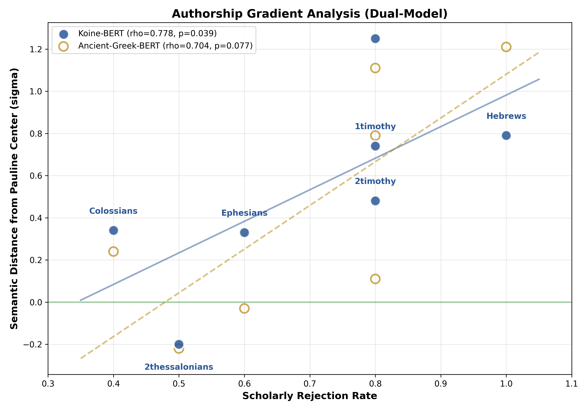

# The Neural Scribe: Authorship Gradient Detection (v2.0)

**Method**: One-Class Neural Classification with Gradient Testing  
🌐 **[Interactive Results Website](https://agnieszkachr.github.io/neural-scribe-pilot/)**  
⏪ **[View v1.0 (Original Pilot with Ancient-Greek-BERT only)](https://github.com/Agnieszkachr/neural-scribe-pilot/tree/v1.0)**

## What's New in v2.0

- **Koine-BERT** (domain-adapted to biblical Greek) as primary embedding model
- **Statistically significant gradient**: ρ = 0.778, p = 0.039
- **Cross-model robustness check** with Ancient-Greek-BERT confirms the trend
- **Titus** upgraded from marginal to Moderate divergence (p = 0.027)
- Dual-model `--model koine|ancient|both` CLI interface

## Scientific Goal

This pilot tests whether neural embeddings detect an **authorship gradient** 
consistent with scholarly consensus on Pauline authorship:

| Text | Scholarly Status | Rejection Rate |
|------|------------------|----------------|
| Undisputed Paul | Authentic | 0% |
| Colossians | Contested | ~40% |
| 2 Thessalonians | Contested | ~50% |
| Ephesians | Contested | ~60% |
| 1 Timothy | Likely pseudepigraphal | ~80% |
| 2 Timothy | Likely pseudepigraphal | ~80% |
| Titus | Likely pseudepigraphal | ~80% |
| Hebrews | Non-Pauline (consensus) | 100% |

## Methodology

### One-Class Classification
The baseline centroid and variance are computed using ONLY undisputed Pauline 
texts. Disputed texts are then measured against this baseline without 
influencing it, avoiding circular reasoning.

### Distance Metric
Cosine distance with mean pooling, normalized by intra-Pauline variance:
- σ = 0.0 represents the Pauline centroid
- Positive values indicate divergence from Pauline baseline (in SD units)
- Negative values indicate texts *closer* to centroid than typical Pauline texts

### Text Normalization (Koine-BERT)
Koine-BERT requires monotonic, accent-stripped, lowercase input. All texts are
pre-normalized using NFD decomposition with combining-mark removal before
tokenization. Without this step, accented Greek characters produce `[UNK]`
tokens and the model output is meaningless.

### Metric Selection Rationale

Cosine distance was selected based on:
1. **Literature standard**: Default metric for sentence embeddings 
   (Reimers & Gurevych 2019)
2. **Directional similarity**: Measures semantic orientation independent 
   of magnitude
3. **High-dimensional stability**: No covariance estimation required

### Statistical Framework
- **One-sample t-test**: Tests if target mean differs from 0 (Paul's center)
- **Cohen's d**: Effect size for practical significance
- **Spearman ρ**: Tests gradient correlation with scholarly consensus

## Results — Koine-BERT v0.1 (Primary)

| Text | N chunks | Distance (σ) | 95% CI | P-Value | Cohen's d | Verdict |
|------|----------|--------------|--------|---------|-----------| --------|
| Paul (baseline) | 314 | 0.00 | — | — | — | Baseline |
| Colossians | 20 | 0.34 | [−0.19, 0.86] | 0.193 | 0.32 | Indistinguishable |
| 2 Thessalonians | 10 | −0.20 | [−0.72, 0.32] | 0.408 | −0.23 | Indistinguishable |
| Ephesians | 31 | 0.33 | [−0.08, 0.74] | 0.108 | 0.31 | Indistinguishable |
| 1 Timothy | 20 | **0.74** | [0.35, 1.14] | **0.0009** | **0.80** | **Significant** |
| 2 Timothy | 15 | 0.48 | [−0.26, 1.21] | 0.185 | 0.41 | Indistinguishable |
| Titus | 8 | **1.25** | [0.20, 2.31] | **0.027** | **1.10** | **Moderate** |
| Hebrews | 65 | **0.79** | [0.46, 1.12] | **<0.0001** | **0.67** | **Moderate** |

**Gradient Correlation** (n=7 texts): Spearman ρ = 0.778, **p = 0.039** ✦

### Chunk Distribution Analysis (Koine-BERT)

| Text | % > P75 | % > P90 | % > P95 |
|------|---------|---------|---------| 
| Paul (expected) | 25.0% | 10.0% | 5.0% |
| Colossians | 40.0% | 15.0% | 10.0% |
| 2 Thessalonians | 20.0% | 10.0% | 0.0% |
| Ephesians | 41.9% | 12.9% | 9.7% |
| 1 Timothy | 70.0% | 30.0% | 10.0% |
| 2 Timothy | 33.3% | 26.7% | 20.0% |
| Titus | 75.0% | 37.5% | 37.5% |
| Hebrews | 58.5% | 36.9% | 23.1% |

## Results — Ancient-Greek-BERT (Robustness Check)

| Text | Distance (σ) | P-Value | Cohen's d | Verdict |
|------|--------------|---------|-----------|---------|
| Colossians | 0.24 | 0.261 | 0.25 | Indistinguishable |
| 2 Thessalonians | −0.22 | 0.320 | −0.26 | Indistinguishable |
| Ephesians | −0.03 | 0.868 | −0.03 | Indistinguishable |
| 1 Timothy | **0.79** | **0.0007** | **0.84** | **Significant** |
| 2 Timothy | 0.11 | 0.748 | 0.09 | Indistinguishable |
| Titus | 1.11 | 0.067 | 0.89 | Marginal |
| Hebrews | **1.21** | **<0.0001** | **0.81** | **Significant** |

**Gradient Correlation** (n=7): Spearman ρ = 0.704, p = 0.077

### Cross-Model Summary

| Metric | Koine-BERT | Ancient-Greek-BERT |
|--------|------------|---------------------|
| Gradient ρ | **0.778** | 0.704 |
| Gradient p | **0.039** ✦ | 0.077 |
| 1 Timothy | Significant | Significant |
| Titus | **Moderate** | Marginal |
| Hebrews | Moderate | **Significant** |

Both models converge on the same core finding: semantic distance correlates
with scholarly consensus. The domain-adapted Koine-BERT achieves statistical
significance, while Ancient-Greek-BERT shows the same trend.

## Classic Stylometry Baseline

Classic stylometry (PCA on MFW z-scores with 100 MFW) shows high lexical similarity 
across all texts, confirming surface-level stylistic consistency. Classic methods
cannot distinguish disputed letters from Paul, motivating the neural approach.

## Visualization



The scatter plot shows the correlation between scholarly rejection rate and 
neural semantic distance for both models. Koine-BERT (filled circles, solid 
trend line) achieves a statistically significant gradient (ρ = 0.778, p = 0.039).
Ancient-Greek-BERT (open circles, dashed trend) confirms the same trend.

## Interpretation

### Key Findings

1. **Gradient Confirmed**: Semantic distance from Paul correlates with scholarly 
   rejection rates (ρ = 0.778, p = 0.039), reaching statistical significance
   with the domain-adapted Koine-BERT model.

2. **Cross-Model Robustness**: The gradient is reproduced by Ancient-Greek-BERT 
   (ρ = 0.704, p = 0.077), confirming it is not an artefact of a single encoder.

3. **Method Validated**: Hebrews (known non-Pauline) shows significant divergence 
   under both models; 1 Timothy is consistently flagged.

4. **Pastoral Split**: 1 Timothy shows clear divergence under both models, while 
   2 Timothy remains indistinguishable. Titus reaches Moderate divergence under 
   Koine-BERT (p = 0.027).

5. **Contested Letters**: Colossians (0.34σ) and Ephesians (0.33σ) show slight 
   positive divergence under Koine-BERT but remain indistinguishable — consistent 
   with their genuinely contested scholarly status.

### Limitations & Pilot Simplifications

1. **Overlapping chunks**: 50% stride overlap inflates effective sample size; 
   future work will use dependence-aware inference (block bootstrap).
2. **Unweighted effect sizes**: Cohen's d uses simple variance averaging; future 
   work will implement sample-size-weighted pooled estimators.
3. **Punctuation removed**: Stripping punctuation degrades syntactic signals; 
   future work will retain Greek punctuation for the neural pipeline.
4. **Small N per text**: Titus (n=8) and 2 Thessalonians (n=10) have wide 
   confidence intervals due to limited text length.
5. **Zero-shot only**: Fine-tuned models may reveal additional signal.

## Quick Start

```bash
# Create environment and install dependencies
uv venv
uv pip install -r requirements.txt

# Step 1: Classic baseline
uv run python run_classic_baseline.py

# Step 2: Neural probe (default: Koine-BERT)
uv run python run_neural_probe.py

# Step 2 (alt): Both models
uv run python run_neural_probe.py --model both

# Step 3: Visualize
uv run python visualize_dissociation.py
uv run python create_gradient_plot.py
```

## Project Structure

```
neural-scribe-pilot/
├── data_loader.py              # Corpus fetching, parsing, segmentation
├── run_classic_baseline.py     # Classic stylometry (PCA on MFW z-scores)
├── run_neural_probe.py         # One-class neural classification (dual-model)
├── visualize_dissociation.py   # 4-panel dissociation comparison
├── create_gradient_plot.py     # Dual-model gradient scatter
├── requirements.txt            # Python dependencies
├── README.md
├── data/                       # Cached SBLGNT files (auto-downloaded)
│   └── *.txt
├── results/                    # Analysis outputs
│   ├── classic_results.json
│   ├── neural_results_koine.json    # Primary (Koine-BERT)
│   ├── neural_results_ancient.json  # Robustness (AG-BERT)
│   ├── embeddings_koine.npz
│   ├── embeddings_ancient.npz
│   ├── dissociation.png
│   └── gradient_scatter.png
└── docs/                       # Interactive results website (GitHub Pages)
    ├── index.html
    ├── about.html
    ├── style.css
    ├── charts.js
    └── favicon.svg
```

## Technical Details

- **Primary Model**: [Koine-Greek-BERT](https://huggingface.co/ABeZet/Koine-Greek-BERT) (domain-adapted from Greek-BERT on biblical Koine)
- **Robustness Model**: [Ancient Greek BERT](https://huggingface.co/pranaydeeps/Ancient-Greek-BERT) (`pranaydeeps/Ancient-Greek-BERT`)
- **Normalization**: NFD accent-stripping + lowercase (Koine-BERT only)
- **Pooling**: Mean pooling with attention mask
- **Distance**: Cosine distance, z-score normalized
- **Window Size**: 150 words with 75-word stride
- **Significance**: α = 0.05 (two-tailed)

---
*Pilot study v2.0, 2026*
